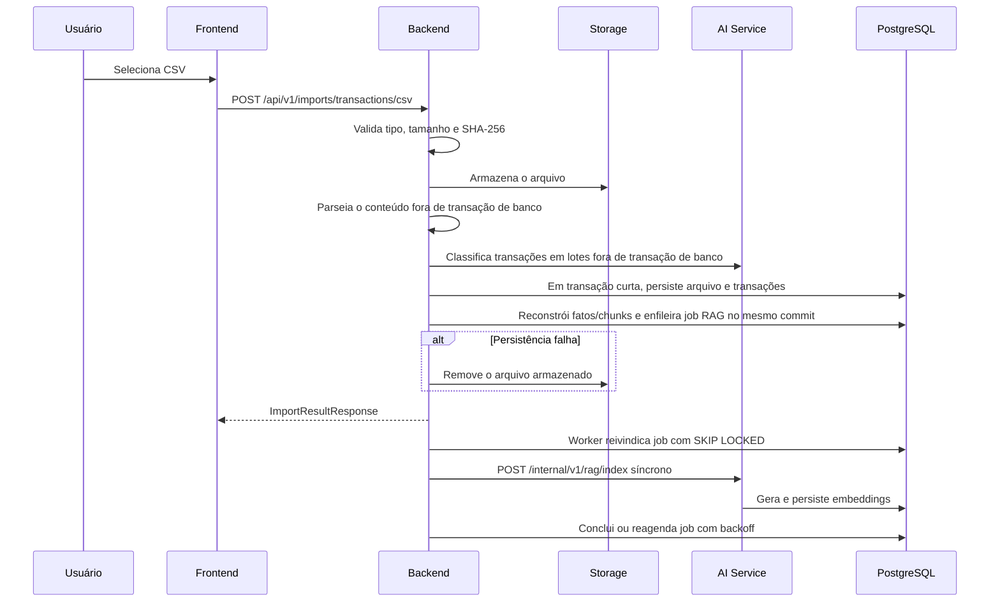
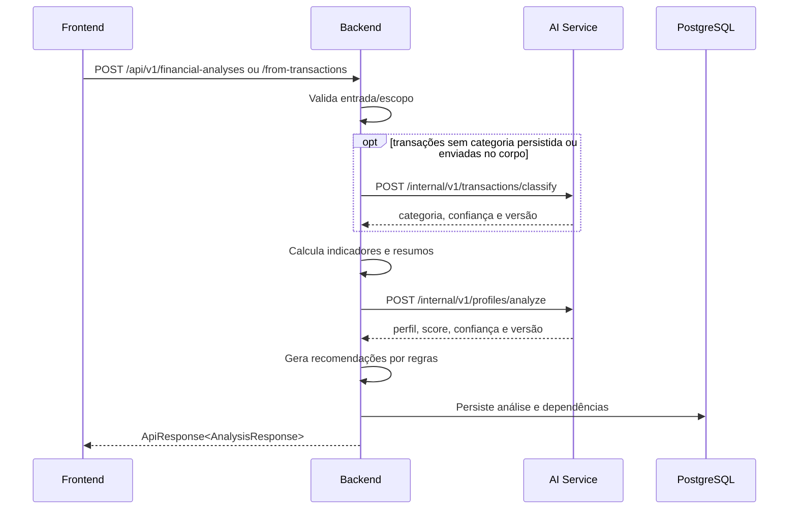
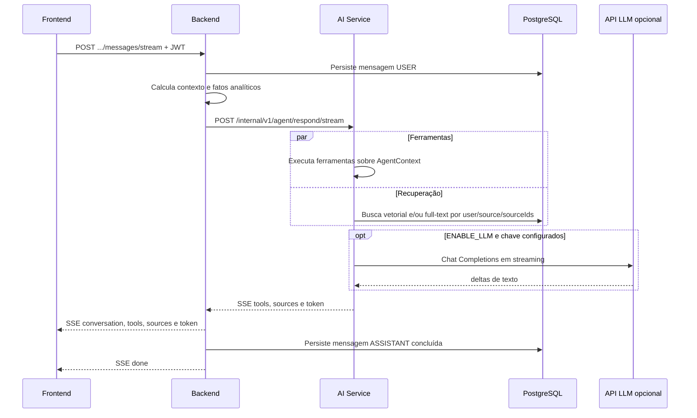

# Arquitetura do FinVise

> Estado atual da arquitetura, dos limites de responsabilidade e dos fluxos entre os componentes do FinVise.

## Visão geral

O FinVise é um monorepo composto por três aplicações e uma camada de infraestrutura:

1. **Frontend** — React 19.2.7, TypeScript, Vite 7.3.6 e PWA.
2. **Backend** — Java 21, Spring Boot 3.2.5, Spring Security, JPA e Flyway.
3. **AI Service** — Python 3.11+, FastAPI 0.115.6, Scikit-learn e agente com ferramentas.
4. **Infraestrutura** — PostgreSQL 16 com `pgvector`, Nginx e Docker Compose.

```text
Navegador
   │
   ▼
Nginx
   ├── / e assets ─────────────────────────────► Frontend
   ├── /api/* e /actuator/health ──────────────► Backend
   └── /internal/* ────────────────────────────► 403
                                                   │
                         ┌─────────────────────────┴─────────────────────────┐
                         ▼                                                   ▼
                  AI Service                                           PostgreSQL
             classificação e agente                          dados relacionais, JSONB,
                         │                                    full-text e pgvector
                         └──────── SQL de RAG ────────────────────────────────▲
```

No Compose local, somente o Nginx é publicado no host, por padrão em `8080`. No override de produção, apenas o Nginx é publicado em `80`; PostgreSQL, backend e AI Service permanecem restritos à rede interna.

## Princípios arquiteturais

- **Monorepo**: aplicações, migrações, infraestrutura, dados de referência e documentação evoluem em conjunto.
- **Backend como API pública**: o navegador não chama o AI Service diretamente.
- **JWT stateless**: identidade e isolamento do usuário são resolvidos no backend.
- **Schema controlado por Flyway**: somente o backend cria ou altera tabelas; o AI Service verifica capacidades e executa SQL de dados em `rag_documents`.
- **Cálculos determinísticos no backend**: indicadores, fatos financeiros, recomendações principais e simulações não dependem da LLM.
- **Fallbacks operacionais**: classificadores por regras/palavras-chave, embeddings locais e respostas seguras permitem funcionamento degradado.
- **Origem explícita**: CSV e Open Finance não são misturados em análises ou conversas que informam uma origem.
- **Deploy simples**: uma única instância com Docker Compose; não há Kubernetes ou fila externa.

## Componentes

### Frontend

Responsabilidades:

- cadastro, login, recuperação de senha e armazenamento local do JWT;
- rotas públicas (`/login`, `/register`, `/forgot-password`) e rotas privadas da aplicação;
- importação CSV, seleção/remoção de fontes e integração do widget Pluggy;
- transações, análises, dashboard, histórico, recomendações e simulação;
- criação de conversa com `source`, `sourceIds` e `topK`;
- leitura incremental dos eventos SSE do agente.

Stack comprovada em `frontend/package.json`: React, React Router, TanStack Query, Axios, React Hook Form, Zod, Recharts, Tailwind CSS, Framer Motion, Vitest, Testing Library e MSW.

O cliente usa `VITE_API_BASE_URL` (padrão `/api/v1`). No servidor Vite, `/api` é encaminhado para `VITE_API_PROXY_TARGET` ou `http://localhost:8080`.

### Backend

Responsabilidades:

- autenticação, autorização por proprietário e redefinição de senha;
- contrato REST público e envelopes de resposta;
- persistência JPA e evolução do schema por Flyway;
- parsing/armazenamento de CSV e deduplicação SHA-256;
- integração Pluggy e deduplicação por ID externo;
- classificação orquestrada, cálculos financeiros, análises e recomendações;
- construção de fatos analíticos e chunks RAG;
- proxy/orquestração do agente, persistência das mensagens e SSE público;
- armazenamento de arquivos local ou OCI Object Storage.

Valores monetários usam `BigDecimal` e `NUMERIC`; datas de transação usam `LocalDate`/`DATE`; eventos e auditoria usam `Instant`/`TIMESTAMPTZ`.

### AI Service

Responsabilidades:

- carregar/validar artefatos Joblib ou ativar classificadores fallback;
- classificar transações e perfil financeiro;
- disponibilizar um motor de recomendações Python interno;
- selecionar e executar ferramentas analíticas sobre o contexto enviado pelo backend;
- gerar respostas por template ou por API compatível com OpenAI Chat Completions;
- gerar embeddings remotos ou locais;
- indexar e recuperar chunks RAG diretamente no PostgreSQL.

O acesso SQL direto é deliberadamente limitado ao pipeline RAG. O AI Service lê a conexão de `SPRING_DATASOURCE_*`/`POSTGRES_*`; as demais tabelas financeiras não são consultadas pelas ferramentas. O backend envia indicadores, transações recentes, recorrências e fatos analíticos no `AgentContext`.

Não há LangChain, SDK oficial da OpenAI nem SHAP nas dependências atuais. Chamadas de LLM e embeddings são feitas com `httpx`.

### PostgreSQL e persistência

O schema efetivo é a composição das migrações `V1`–`V21`:

| Grupo | Tabelas | Finalidade |
| --- | --- | --- |
| Identidade | `users`, `password_reset_codes` | conta e recuperação de senha |
| Transações | `transactions`, `transaction_categories`, `imported_files`, `open_finance_connections` | movimentações e suas fontes |
| Análises | `financial_analyses`, `financial_indicators`, `spending_summaries`, `recommendations` | diagnósticos persistidos |
| Agente | `agent_conversations`, `agent_messages` | origem, opções RAG, histórico, tools e fontes citadas |
| RAG/fatos | `rag_documents`, `rag_index_jobs`, `financial_fact_snapshots` | chunks, vetores, fila durável, status de índice e snapshots JSONB |
| Modelos | `model_versions` | tabela criada no schema inicial; o status HTTP atual vem do registry em memória do AI Service |

Relações e isolamento principais:

- recursos financeiros referenciam `users.id`;
- análises têm indicador 1:1 e resumos/recomendações 1:N;
- mensagens pertencem a conversas;
- transações mantêm `source`, `import_source_id` e, para Pluggy, `external_id`;
- chunks RAG mantêm `user_id`, `source_type`, `source_id`, `chunk_type` e `transaction_id` quando aplicável;
- `financial_fact_snapshots` é único por `(user_id, source_type, source_id)`.

O `pgvector` é habilitado de forma tolerante: em ambientes sem a extensão, Flyway mantém o restante do schema e o RAG pode usar busca full-text por palavras-chave. Quando disponível, `embedding vector(1536)` possui índice HNSW com distância de cosseno.

### Infraestrutura

Serviços do `docker-compose.yml`:

| Serviço | Imagem/build | Exposição local |
| --- | --- | --- |
| `postgres` | `pgvector/pgvector:pg16` | nenhuma porta publicada no Compose base ou no override de produção |
| `backend` | build de `backend/Dockerfile` | somente rede Docker |
| `ai-service` | build de `ai-service/Dockerfile` | somente rede Docker |
| `frontend` | build e Nginx próprio | somente rede Docker |
| `nginx` | `nginx:1.27-alpine` | `8080:80` local; `80:80` em produção |

Volumes nomeados:

- `postgres_data` — dados do banco;
- `uploads_data` — objetos do `LocalObjectStorageService` em `/app/uploads`.

O frontend e o AI Service não iniciam até que suas dependências configuradas estejam saudáveis. O Nginx depende do frontend e do backend.

## Fluxos principais

### Importação CSV



O armazenamento, o parsing e a classificação não mantêm uma transação PostgreSQL aberta. O job RAG é persistido na mesma transação dos chunks. A indexação ocorre depois do commit por um worker do backend, que renova o heartbeat e drena lotes pendentes. Falhas são reagendadas com backoff exponencial; jobs interrompidos podem ser retomados após o timeout do heartbeat e, ao esgotar as tentativas, exigem recuperação manual do estado `DEAD_LETTER`.

### Sincronização Open Finance

1. Frontend consulta o status e solicita um Connect Token ao backend.
2. Backend autentica na Pluggy e vincula `clientUserId` ao UUID do usuário.
3. Após o widget devolver `itemId`, o frontend chama `/items/{itemId}/sync`.
4. Backend verifica o proprietário e busca contas e até 100 páginas de transações por conta sem manter transação de banco aberta.
5. Apenas registros `POSTED` válidos são mapeados; IDs externos existentes são carregados em uma única consulta e somente os candidatos novos são classificados.
6. Uma transação curta, serializada por conexão com advisory lock, grava os registros em lotes com `ON CONFLICT DO NOTHING`, recalcula fatos, cria chunks e registra o job RAG.
7. Depois do commit, o backend calcula o perfil no AI Service e abre outra transação curta apenas para persistir a análise.

Não existe consumidor de webhook no código atual; a sincronização é acionada pelo endpoint. Chamadas à Pluggy e ao AI Service nunca são executadas dentro da transação que persiste a sincronização.

### Análise financeira



Se a classificação remota falhar, o backend preserva fallbacks próprios onde implementados. A análise de transações persistidas exige ao menos uma receita no escopo.

### Agente e RAG



Ferramentas e recuperação rodam em paralelo no AI Service. O LLM recebe apenas o prompt, o histórico, os resultados das ferramentas e as evidências recuperadas. Sem LLM, um provider de template determinístico gera a resposta; se o stream interno falhar antes de produzir texto, o backend usa uma resposta segura baseada nos totais da origem.

## Segurança e limites de confiança

- Nginx é o único serviço publicado no override de produção.
- `/internal/` recebe `403` no Nginx e o FastAPI exige um Bearer token de serviço em todas as rotas internas.
- Agente e RAG recebem o UUID em `X-FinVise-User-Id` somente após autenticar o backend; `user_id` no corpo é rejeitado.
- O backend aplica JWT e extrai o usuário do principal autenticado.
- Consultas RAG sempre filtram `user_id` e opcionalmente origem/fontes.
- Credenciais Pluggy e chaves de LLM ficam no servidor.
- O Compose atual termina somente HTTP. TLS deve terminar antes da instância ou ser adicionado por configuração específica.

Consulte `docs/security.md` para controles e pendências.

## Decisões arquiteturais

As decisões e seus ajustes estão em `docs/adr/`. Em especial:

- ADR 003 documenta o acesso SQL restrito do AI Service para RAG;
- ADR 006 descreve ferramentas, RAG e fallbacks do agente;
- ADR 007 limita o Object Storage implementado aos arquivos CSV importados;
- ADR 008 define a fila PostgreSQL durável para indexação RAG.
- ADR 011 define a autenticação e a propagação confiável de identidade entre backend e AI Service.

## Escopo implementado

O código atual cobre um fluxo vertical mais amplo que o MVP inicial: autenticação e reset de senha, duas origens de ingestão, gestão de fontes, análises selecionáveis, fatos financeiros, RAG híbrido, agente síncrono/SSE, armazenamento opcional e deploy Compose.

Fora do escopo comprovado no repositório:

- webhook receptor de Open Finance;
- exportação real de relatório em PDF/Excel;
- terminação TLS pronta no Nginx versionado;
- fila externa dedicada; a fila RAG implementada usa o próprio PostgreSQL;
- revogação de JWTs de login após redefinição de senha;
- montagem de credenciais OCI no Compose;
- escalabilidade horizontal ou Kubernetes.
