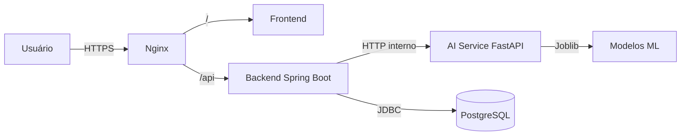
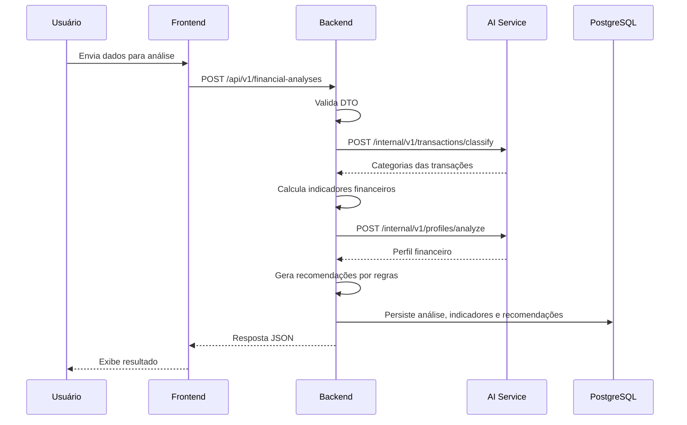

# Arquitetura do Finance AI

## Visão geral

O Finance AI é um assistente inteligente de saúde financeira. A proposta central é ir além de mostrar para onde o dinheiro foi: ele explica o que está acontecendo e indica o próximo passo.

A solução é composta por três aplicações principais:

1. **Frontend** — React + TypeScript + Vite + PWA.
2. **Backend** — Java 21 + Spring Boot 3 + PostgreSQL.
3. **AI Service** — Python + FastAPI + Pandas + Scikit-learn.

A comunicação entre os componentes segue o fluxo:

```
Usuário
   ↓ HTTPS
Nginx
   ├── /                 → frontend
   └── /api              → backend Spring Boot
                                ↓
                         ai-service FastAPI
                                ↓
                         modelos de ML
```

## Princípios arquiteturais

- **MVP funcional**: arquitetura simples, sem Kubernetes ou componentes desnecessários.
- **Deploy em uma única instância**: toda a solução roda em uma OCI Compute Instance com Docker Compose.
- **Segurança por padrão**: apenas as portas 80 e 443 são públicas em produção.
- **Backend como porta de entrada**: o frontend nunca chama o ai-service diretamente.
- **AI Service sem acesso ao banco**: ele apenas expõe endpoints internos consumidos pelo backend.
- **Fallbacks determinísticos**: o sistema funciona mesmo sem modelos treinados ou chaves de LLM.

## Componentes

### Frontend

- Responsivo e preparado para PWA.
- Comunica-se com o backend via `/api/v1`.
- Stack: React, TypeScript, Vite, React Router, TanStack Query, React Hook Form, Zod, Recharts.

### Backend

- Responsável por autenticação, validação, persistência, regras de negócio, orquestração e resposta final.
- Stack: Spring Boot 3, Spring Security, JWT, Spring Data JPA, Flyway, PostgreSQL.
- Valores monetários usam `BigDecimal`; banco usa `NUMERIC`.

### AI Service

- Responsável por pré-processamento, classificação de transações, classificação de perfil, probabilidades, explicabilidade e ferramentas do agente.
- Stack: FastAPI, Pandas, Scikit-learn, Joblib.
- Possui classificadores fallback baseados em regras/keywords.
- Agente baseado em ferramentas com LLM opcional.

### Infraestrutura

- Docker Compose orquestra nginx, frontend, backend, ai-service e PostgreSQL.
- Nginx atua como reverse proxy e rate limiter.
- PostgreSQL roda apenas na rede interna do Docker.
- Scripts de backup/restore e health check em `infrastructure/scripts/`.

## Diagramas

### Diagrama de implantação



### Fluxo da análise financeira



## Decisões arquiteturais

As decisões principais estão documentadas em `docs/adr/`.

## Escopo do MVP

A primeira entrega implementa um fluxo vertical mínimo:

1. Frontend envia uma análise.
2. Backend valida os dados.
3. Backend chama o ai-service.
4. AI Service classifica as transações.
5. Backend calcula os indicadores.
6. AI Service retorna o perfil.
7. Backend gera recomendações por regras.
8. Backend persiste a análise.
9. Backend retorna JSON.
10. Frontend exibe o resultado.
