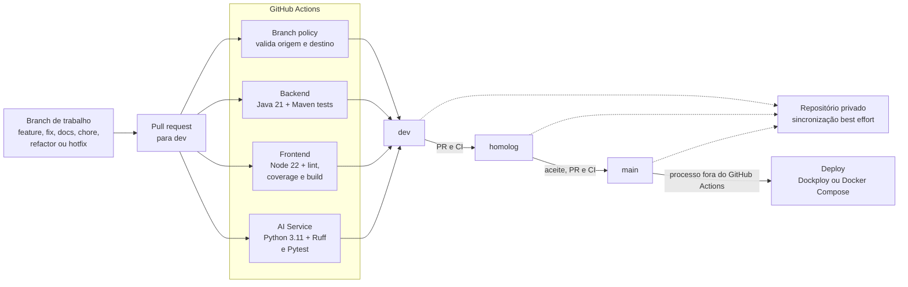

# Estratégia de CI/CD

> Estado da integração, promoção e entrega contínua comprovado pelos workflows versionados em `.github/workflows/`.

## Visão geral

O FinVise adota quatro etapas separadas:

1. **integração contínua** em pull requests e pushes das branches permanentes;
2. **controle do caminho de promoção** entre `dev`, `homolog` e `main`;
3. **espelhamento de melhor esforço** das branches permanentes para um repositório privado;
4. **deploy externo ou manual** a partir de `main`, usando Docker Compose/Dockploy.



A fonte reutilizável do desenho está em [`docs/diagrams/ci-cd.mmd`](diagrams/ci-cd.mmd).

## Integração contínua

O workflow [`.github/workflows/ci.yml`](../.github/workflows/ci.yml) roda em:

- `pull_request` destinado a `dev`, `homolog` ou `main`;
- `push` realizado em `dev`, `homolog` ou `main`.

Os três jobs são independentes e podem executar em paralelo:

| Job | Ambiente | Comandos validados |
| --- | --- | --- |
| Backend tests | Ubuntu, Temurin Java 21 e cache Maven | `mvn --batch-mode test` |
| Frontend checks | Ubuntu, Node 22 e cache npm | `npm ci`, lint, cobertura e build Vite/TypeScript |
| AI service checks | Ubuntu, Python 3.11 e cache pip | instalação pelo lockfile, Ruff e Pytest |

O workflow possui apenas permissão `contents: read`. Ele não recebe segredos de runtime, não publica imagens Docker e não altera ambientes.

## Política de branches e promoção

O workflow [`.github/workflows/branch-policy.yml`](../.github/workflows/branch-policy.yml) valida pull requests abertos, reabertos, editados ou atualizados:

| Destino | Origem aceita pelo workflow |
| --- | --- |
| `dev` | `feature/*`, `fix/*`, `chore/*`, `docs/*`, `refactor/*` ou `hotfix/*` |
| `homolog` | exclusivamente `dev` |
| `main` | exclusivamente `homolog` |

Assim, o caminho automatizado é:

```text
branch de trabalho -> dev -> homolog -> main
```

O arquivo [`.github/CODEOWNERS`](../.github/CODEOWNERS) atribui todo o repositório a `@lucasabreuzip`. A exigência efetiva de aprovação, checks obrigatórios, bloqueio de push direto e proibição de force push depende das regras de proteção configuradas no GitHub; os arquivos versionados não criam essas regras sozinhos.

Um `hotfix/*` também deve entrar por `dev` e seguir a promoção normal. O workflow atual rejeita um PR direto de `hotfix/*` para `main`. Qualquer exceção depende de intervenção administrativa do proprietário e deve registrar justificativa, risco e rollback no PR.

## Espelhamento para o repositório privado

O workflow [`.github/workflows/sync-to-privado.yml`](../.github/workflows/sync-to-privado.yml) roda após pushes em `dev`, `homolog` e `main` e envia a branch correspondente para o repositório privado.

Características atuais:

- checkout com histórico completo (`fetch-depth: 0`);
- autenticação por `PRIVADO_PAT`, com fallback para `github.token`;
- envio com `--force` para manter o espelho idêntico;
- falhas ignoradas por `|| true`.

Por ser tolerante a falhas, esse workflow não é um gate de entrega e um check verde não comprova que o espelho foi atualizado. Ele também não realiza deploy.

## Entrega e deploy

Não existe workflow versionado que:

- construa e publique imagens em um registry;
- crie release ou tag automaticamente;
- use GitHub Environments;
- execute migrations ou `docker compose up` no servidor;
- promova o mesmo artefato imutável entre ambientes;
- valide health check ou execute rollback depois do deploy.

Consequentemente, a parte de CD termina na aprovação e integração em `main`. O deploy é realizado por processo externo, como Dockploy conectado ao repositório, ou manualmente com o Compose de produção. Gatilhos, credenciais, domínio e política de rede configurados no Dockploy não estão versionados neste repositório.

Para uma entrega manual, o operador deve:

1. selecionar um commit aprovado de `main`;
2. reconstruir os serviços com `docker-compose.yml` e `docker-compose.production.yml`;
3. verificar `/health` e `/actuator/health`;
4. acompanhar logs e migrações Flyway;
5. reimplantar o SHA anterior se for necessário rollback.

O procedimento operacional completo está em [Deploy na OCI](deployment-oci.md).

## Responsabilidades automatizadas e manuais

| Etapa | Estado atual |
| --- | --- |
| Testes backend/frontend/AI | automatizado no GitHub Actions |
| Lint, cobertura frontend e build frontend | automatizado no GitHub Actions |
| Validação do caminho entre branches | automatizado no GitHub Actions |
| Revisão e aceite funcional | manual |
| Espelhamento privado | automatizado, mas sem garantia de sucesso |
| Build/publicação de imagens | manual ou externo |
| Deploy em homologação/produção | manual ou externo |
| Health check pós-deploy e rollback | manual |

## Limites e evoluções recomendadas

- remover `|| true` do espelhamento ou criar uma verificação observável separada;
- evitar `--force` quando o repositório privado deixar de ser apenas um espelho;
- construir e testar as imagens Docker na CI;
- publicar imagens identificadas pelo SHA do commit;
- configurar GitHub Environments e aprovação de produção;
- automatizar deploy, health check e rollback sem armazenar segredos no repositório;
- adicionar análise de dependências, imagens e segredos ao pipeline.

Esses itens são recomendações; não descrevem capacidades existentes.
